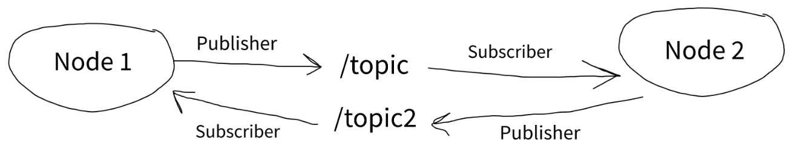

# Publisher Subscriber Paradigm
## ROS structure
This chapter explains ROS and fundamental ideas that are used.
### Publisher Subscriber
Within the project, there are nodes. Each node is an item that can either submit or receive information, both called a publisher, and a subscriber respectively. Nodes typically depend on a topic as a middleman for the flow of information. Topics are there to route information from publishers, to subscribers. Think of it like a magic voodoo land where publishers dump the information, awaiting a subscriber to collect. There can only be on node per python executable, meaning each python file can only run a publisher node, or subscriber node. As hinted, you use python to initialized the nodes, and spin them up to begin functioning. 


in this example, Node 1 is a publisher of the /topic topic. It can provide information to this topic only. Node 2 is a subscriber to /topic and can only receive the information.

#### Making a Node
Firstly, make a new python class in your file. We will call it MyClass. A class is explained further down this file, in the Python section. 

Now, you have to initialize a node with a name
```py
rospy.init_node("Party Planner")
```

Then you can define a publisher
```py
self.bday_pub = rospy.Publisher('/topic', String, 1)
```
the `rospyPublisher.Publisher` function needs a topic name, the type of data being sent, and a queue size. (usually 1 or 10)

Then you can initialize a subscriber
```py
rospy.Subscriber('/other_topic', String, self.do_something)
```
The function needs the topic name, the data type that it will receive, and the function name that will automatically occur when it receives data. In this case, it will call the `self.do_something` function when it receives a `String`

To publish (send) information, use the `publish` function
```py
self.bday_pub.publish("your data here")
```

You can add a delay also to ease the data publishing for what ever reason you need
```py
rospy.sleep(2000)
```
In this code, it will delay the program for 2000 milliseconds or 2 seconds. 

To run the node, we use the `run` function
```py
MyClass().run()
```
In this case, you are using the run command on the `MyClass` class, which is the class that we made the node. You can usually put this in the main function, explained in the Python section.
#### Examples
Here is an example of a Publisher node and Subscriber node:

In file ~/catkin_ws/src/my_pkg/src/party_planner.py
```
class PartyPlanner:
     def __init__(self):
          # Initialize a node
          rospy.init_node("Party Planner")

          # Create a publisher from Party Planner to /jairs_bday with datatype String
          self.bday_pub = rospy.Publisher('/jairs_bday', String, 1)

          # Publish some messages with a delay
          self.bday_pub.publish("hi")
          rospy.sleep(2000)
          self.bday_pub.publish("lol")
```

In file ~/catkin_ws/src/my_pkg/src/party_receiver.py
```
class PartyReceiver:
     def __init__(self):
          # Initialize a node
          rospy.init_node("Party Receiver")

          # Create a subscriber from /jairs_bday to Party Receiver that listens for String data
          rospy.Subscriber('/jairs_bday', String, self.do_something)

     # Define the callback function
     def do_something(self, msg):
           print(msg)
```

Within each of these classes, we can also put a `run` function that will start the node when we run the program.
```py
class MyClass:
	# node creation goes here
	...
	# the run funciton to start the node
	def run(self):
		rospy.spin()
		
if __name__ == "__main__":
	MyClass.run()
```

### Services
A service is when you have one node that publishes, and one node that subscribes. The publisher node directly sends to the subscriber instead of a topic. 